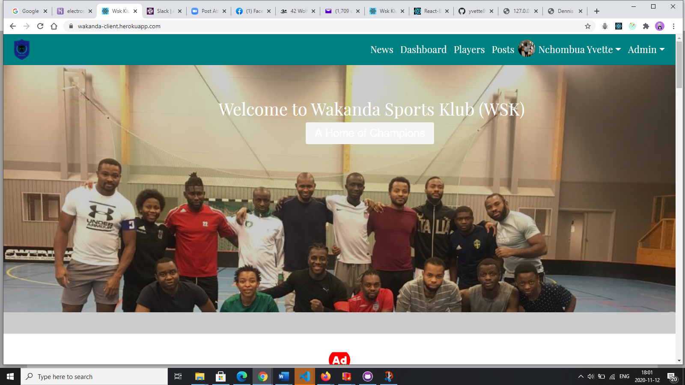

# Wakanda Sports Klub
### This is a website built for my sports klub called WSk. This is a link to the site: [wakanda Sports klub](https://wakanda-client.herokuapp.com).

### I built this using the MERN Stack. This is a picture of the landing page



## Features
* Complete Webpage
* Add Events, get Events, Delete Events, Event Details and reviews on Events
* Get players, Get single Player
* Add Profile
* Edit Profile
* Delete Account
* Add Experince
* Create a post
*Like a post
* Unlike a post
* Comment on a post
* Delete a post
*Admin Post and players moderation

## Install Dependencies
```
npm install
## Run
npm run dev
```
## Build and Deploy
```
Create frontend prod build
npm  run build
```
### There is a heroku postbuild script, so if you push to Heroku, no need to build manully for deployment to heroku

